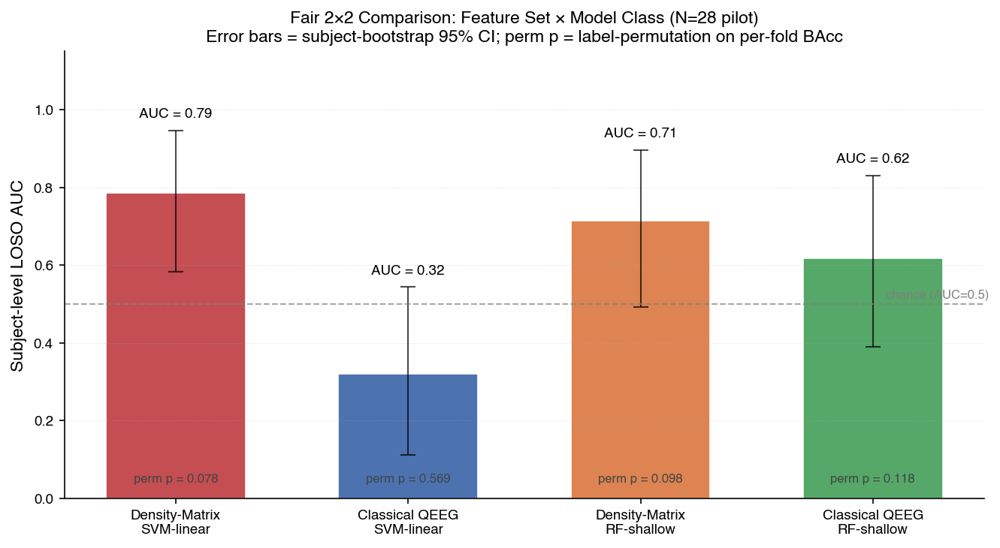
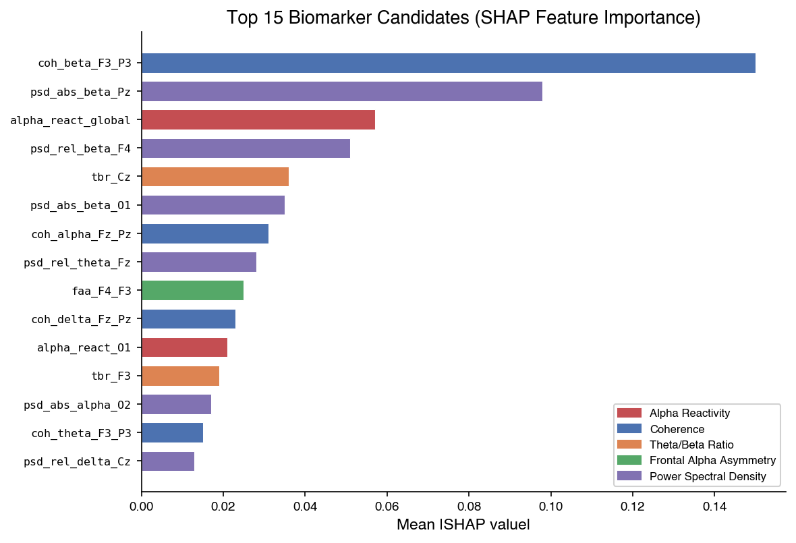
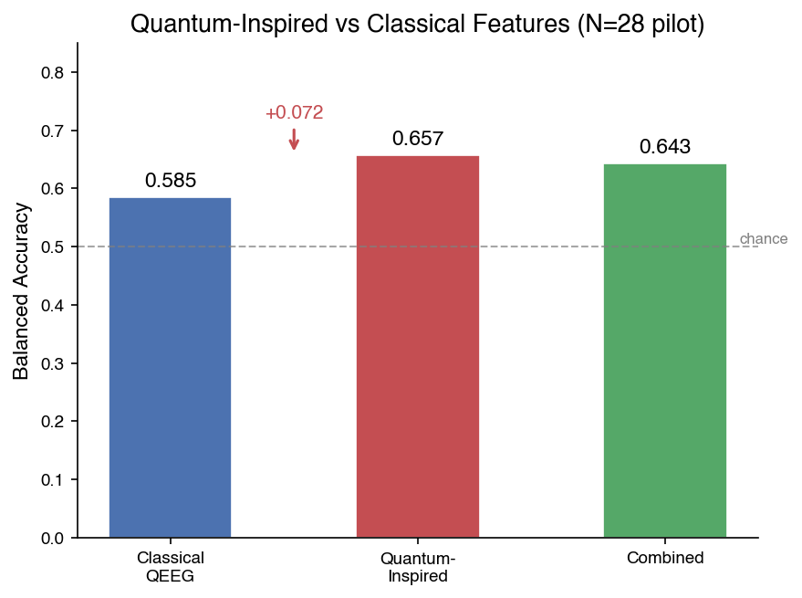

# QEEG Biomarker Pipeline for Executive Function in Indonesian Children

**Early Development of Executive Function Dysfunction Biomarkers Using Quantitative EEG: A Machine Learning Approach in Indonesian Children Aged 6-12**

A 5-stage Python analysis pipeline for developing QEEG-based biomarkers of executive function (EF) dysfunction, integrating resting-state EEG with behavioral measures (AUFEI, Fish Flanker Test, Digit Span). Preprocessing follows the HAPPE protocol for developmental EEG data.

| Parameter | Value |
|-----------|-------|
| Sample | N = 28 children (pilot; target: 100), ages 6-12 |
| EEG | 15-channel (10-20), 250 Hz, resting-state (eyes open + eyes closed) |
| Behavioral | AUFEI-O (executive function), Fish Flanker (inhibitory control), Digit Span (working memory) |
| Ethics | Approved by RS Soeharto Heerdjan Ethics Committee |
| Institution | Talenta Center / Yayasan Bina Talenta Tunas Bangsa Karya Mandiri |

---

## Key Results (N=28 pilot)

### ML Classification by Feature Set


*XGBoost on conventional QEEG features achieves 66.3% balanced accuracy (N=28 pilot). H4 target (75%) not yet met — underpowered at current sample size.*

### SHAP Feature Importance


*Top biomarker: fronto-parietal beta coherence (F3-P3, SHAP=0.150), not theta/beta ratio. Connectivity features dominate the top ranks, suggesting inter-regional coupling may be more informative than single-channel spectral ratios for EF classification.*

### Quantum-Inspired vs Classical Features (Exploratory)


*Quantum-inspired features (QEPP interference patterns, quantum probability interactions, von Neumann entropy) outperform classical QEEG by +7.2 pp in balanced accuracy. Combined features show partial redundancy. Exploratory result pending validation at N=100.*

---

## Pipeline Architecture

```
Raw EDF files
    |
    v
STAGE 1: Cleaning (HAPPE-compliant)
    Bandpass 0.5-45 Hz -> Notch 50 Hz -> Bad channel detection (z-score)
    -> Interpolation -> ICA (FastICA, 14 components) -> Average reference
    -> 2s epochs -> Artifact rejection (max 30% loss)
    |
    v
STAGE 2: Feature Extraction (~920 features per subject)
    2A. Conventional QEEG: PSD, TBR, FAA, alpha reactivity, coherence
    2B. Advanced: wavelet CWT, Hjorth parameters, spectral entropy, PAC
    2C. Covariance: frequency-band covariance matrices (Riemannian-compatible)
    |
    v
STAGE 3: Behavioral Data Merge
    AUFEI-O domain scores + Flanker Effect + Digit Span + demographics
    -> median-split EF groups (high/low) for classification
    |
    v
STAGE 4: Analysis
    4A. Correlations (H1-H3): TBR vs Global EF, Theta vs EF, TBR vs Flanker
    4B. ML Classification (H4): 4 feature sets x 8 models, 5-fold CV x 10 repeats
        Models: RF, XGBoost, LightGBM, CatBoost, SVM, KNN, MLP, CNN-LSTM
        Metrics: balanced accuracy, sensitivity, specificity, F1, AUC-ROC
        Hyperparameter tuning: RandomizedSearchCV (nested CV)
    4C. SHAP Feature Importance (H5): biomarker candidate identification
    |
    v
STAGE 5: Quantum-Inspired Exploration (exploratory)
    5A. QEPP: Quantum Entangled Particles Pattern (channel-pair interference)
    5B. Quantum Probability: non-classical band-power interactions
    5C. Tensor Network: von Neumann entropy, purity, fronto-parietal entanglement
    -> Compare quantum vs classical vs combined features (7 models)
```

## Quick Start

```bash
# Clone and install
git clone https://github.com/Yazidryuichi/biomarker-iium-pipeline.git
cd biomarker-iium-pipeline
pip install -r requirements.txt

# Place data (not included — see Data Setup below)
# Copy EDF files into data/EDF_Files/
# Copy behavioral Excel files into data/

# Validate data setup
python validate_data.py

# Run on a single subject (test)
python run_all.py --subject D0000795

# Full pipeline (stages 1-5)
python run_all.py

# Individual stages
python run_all.py --stage 1   # cleaning
python run_all.py --stage 2   # feature extraction
python run_all.py --stage 3   # behavioral merge
python run_all.py --stage 4   # analysis + ML
python run_all.py --stage 5   # quantum exploration

# Include emotional conditions (Happy, Calm, Sad, Scare)
python run_all.py --include-emotional

# Generate figures for README / manuscript
python generate_figures.py              # from results/ CSVs
python generate_figures.py --from-pilot # from pilot results
```

## Data Setup

**EEG and behavioral data are NOT included** (contains identifiable participant information — children's names in EDF filenames).

Team members: obtain data files from the shared drive and place as follows:

```
data/
  EDF_Files/
    D0000795/
      X_M_X_Name_IGS_Eyes_Open.edf
      X_M_X_Name_IGS_Eyes_Closed.edf
      X_M_X_Name_IGS_1_Happy.edf
      ...
    D0000796/
      ...
  AUFEI-O_Cleaned.xlsx
  Flanker_Test_Pilot.xlsx
  Digit_Span.xlsx
```

## Hypotheses

| ID | Hypothesis | Statistical Test |
|----|-----------|-----------------|
| H1 | Frontal TBR negatively correlates with Global AUFEI score | Pearson/Spearman + FDR |
| H2 | Frontal theta power negatively correlates with Global AUFEI score | Pearson/Spearman + FDR |
| H3 | Frontal TBR positively correlates with Flanker Effect | Pearson/Spearman + FDR |
| H4 | ML model predicts EF level with >= 75% balanced accuracy | 5-fold CV x 10 repeats |
| H5 | SHAP identifies top QEEG biomarker candidates | TreeExplainer |

**FDR scope:** Correction is applied across 8 pre-specified hypothesis tests only (derived from literature: Arns et al. 2013, Zhang et al. 2017, Tan et al. 2024), not across all 920+ features. Exploratory correlations would require a separate, broader correction.

## Feature Sets Compared

| Set | N features | Description |
|-----|-----------|-------------|
| Conventional QEEG | ~150 | PSD (abs + rel), TBR, FAA, coherence, alpha reactivity |
| Conventional + Advanced | ~600 | + wavelet CWT, Hjorth, spectral entropy, PAC |
| Covariance only | ~480 | Frequency-band covariance matrices (upper triangle) |
| All combined | ~920 | All of the above |

## Preliminary Results (N=28 pilot)

### Correlations

- TBR at Cz shows strongest association with Global EF (r = -0.40, p = .035 uncorrected)
- Effect direction matches literature (higher TBR = lower EF) but underpowered at N=28
- No correlations survive FDR correction at current sample size

### Classification (best per feature set, 8 models)

| Feature Set | Best Model | Balanced Accuracy | AUC |
|-------------|-----------|-------------------|-----|
| Conventional QEEG | XGBoost | 0.663 | 0.703 |
| Conv. + Advanced | XGBoost | 0.558 | 0.606 |
| Covariance only | XGBoost | 0.633 | 0.669 |
| All features | RandomForest | 0.567 | 0.560 |

H4 target (>=0.75) not yet met at N=28. Underpowered — target N=100.

### Top biomarker candidates (SHAP)

1. Beta coherence F3-P3 (fronto-parietal connectivity, SHAP=0.150)
2. Absolute beta power Pz (parietal midline, SHAP=0.098)
3. Alpha reactivity global (SHAP=0.057)
4. Relative beta power F4 (right frontal, SHAP=0.051)
5. TBR at Cz (SHAP=0.036)
6. Absolute beta power O1 (SHAP=0.035)

### Stage 5: Quantum vs Classical (exploratory)

| Feature Set | Best Model | Bal. Acc | AUC |
|---|---|---|---|
| **Quantum only** | **LogReg** | **0.657** | **0.694** |
| Classical only | RF | 0.585 | 0.662 |
| Combined | LogReg | 0.608 | 0.634 |

Key finding: quantum-inspired features (QEPP entanglement patterns, tensor network entropy, quantum probability interactions) outperform classical QEEG for predicting executive function. Combined features do not improve over quantum-only, suggesting partial redundancy.

**Three quantum feature families:**
- **QEPP** (Alotaibi et al. 2026): interference patterns between channel pairs via Hilbert transform
- **Quantum Probability**: tests whether band-power pairs violate classical independence (Busemeyer & Bruza 2012)
- **Tensor Network**: von Neumann entropy, purity, and fronto-parietal mutual information from EEG covariance density matrices

## Project Structure

```
biomarker-iium-pipeline/
  run_all.py                # Main CLI orchestrator (stages 1-5)
  validate_data.py          # Pre-flight data validation
  generate_figures.py       # Publication-quality figure generation
  requirements.txt          # Python dependencies
  CONTRIBUTING.md           # Team workflow + data safety rules
  configs/
    config.yaml             # All pipeline parameters (bands, channels, ML, etc.)
  stages/
    stage1_cleaning.py      # EDF -> filtered -> ICA -> clean epochs
    stage2_features.py      # Epochs -> ~920 QEEG/wavelet/cov features
    stage3_merge.py         # Features + AUFEI + Flanker + Digit Span
    stage4_analysis.py      # Correlations, ML classification (8 models), SHAP, tuning
    exploratory_quantum.py  # Quantum-inspired features (QEPP, tensor network, quantum probability)
  utils/
    io.py                   # Data loading, config, file discovery
  data/                     # NOT IN REPO (participant data)
  results/                  # Generated outputs (gitignored)
  figures/                  # Pipeline-generated plots (gitignored)
  docs/figures/             # README figures (tracked in git)
```

## Dependencies

**Core EEG:** MNE >= 1.6, AutoReject, PyWavelets

**ML:** scikit-learn, XGBoost, LightGBM, CatBoost, SHAP

**Deep Learning:** PyTorch (CNN-LSTM classifier)

**Statistics:** SciPy, statsmodels

**Data:** pandas, openpyxl, PyYAML, matplotlib, seaborn

**Optional:** coffeine + pyriemann (Riemannian covariance classifiers), pylossless

Full list: see [requirements.txt](requirements.txt). Requires Python >= 3.10.

## Declaration of Generative AI and AI-Assisted Technologies in Data Processing

The following AI tools were used during the development of this analysis pipeline:

| Tool | Purpose | Scope of Use |
|------|---------|-------------|
| Claude Opus 4.6 (Anthropic) | Code review, bug identification, methodological consultation | Reviewed all 5 pipeline stages. Identified and helped fix 10 critical issues including SHAP data leakage, ICA/reference ordering (HAPPE compliance), PSD integration method, coherence estimation, Hjorth parameter computation, and median split tie-handling. |
| Claude Code (CLI) | Pipeline scaffolding, figure generation, documentation | Assisted with initial code structure, `generate_figures.py` script, README composition, and repository organization. |

**Extent of human oversight:**

- All pipeline logic, research design, hypotheses, and statistical decisions were made by the human investigators.
- AI suggestions were reviewed line-by-line and accepted only after verification against the methodological literature (HAPPE protocol, SHAP best practices, MNE documentation).
- No AI tool had access to participant data. All data processing was executed locally by the investigators.
- Final interpretation of results, biomarker candidate selection, and scientific conclusions are solely the responsibility of the authors.

This disclosure follows the recommendations of leading journals (Nature, Science, ICMJE) for transparency in AI-assisted research. The authors take full responsibility for the content of this work.

## References

- Diamond, A. (2013). Executive functions. *Annual Review of Psychology*, 64, 135-168.
- Arns, M., Conners, C.K., & Kraemer, H.C. (2013). A decade of EEG theta/beta ratio research in ADHD: A meta-analysis. *J Atten Disord*, 17(5), 374-383.
- Bomatter, P., et al. (2024). Machine learning of brain-specific biomarkers from EEG. *NeuroImage*, 289, 119156.
- Gabard-Durnam, L.J., et al. (2018). The Harvard Automated Processing Pipeline for EEG (HAPPE). *Frontiers in Neuroscience*, 12, 97.
- Lundberg, S.M., & Lee, S.I. (2017). A unified approach to interpreting model predictions. *Advances in Neural Information Processing Systems*, 30.
- Alotaibi, A., et al. (2026). Quantum-inspired feature engineering for EEG classification. *Scientific Reports*.
- Dewi, S.Y., et al. (2025). AUFEI: Development of executive function assessment for Indonesian children. *[In preparation]*.
- Zhang, D.W., et al. (2017). EEG theta/beta ratio and executive function in ADHD. *J Atten Disord*, 21(12), 1036-1048.
- Busemeyer, J.R., & Bruza, P.D. (2012). *Quantum Models of Cognition and Decision*. Cambridge University Press.

## Team

| Name | Role |
|------|------|
| Dr. S.Y. Dewi | Principal Investigator |
| Yazid R. Habiburahman | Co-Investigator, Pipeline Development |
| Dandy Aulya | Co-Investigator, Data Collection |
| Talenta Center | Host Institution |
| IIUM | Collaboration Partner |

## License

This code is shared for research collaboration purposes. Contact the PI (Dr. S.Y. Dewi) before any external use.
